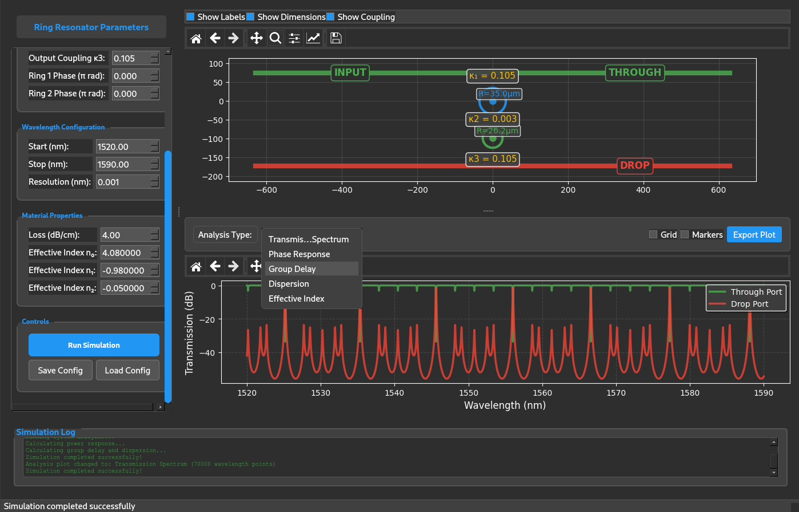

# Ring Resonator Design

A Python package for designing and simulating coupled ring resonator systems. This package provides tools for analyzing transmission spectra, phase response, group delay, and dispersion characteristics, with both command-line and graphical user interfaces.



## Features

- Configure 1 to N ring resonator systems with real-time visualization
- Scattering matrix calculations using the transfer matrix method
- Effective index dispersion modeling
- Dark-theme GUI with matplotlib plots
- Analysis tools for transmission spectra, phase response, group delay, and dispersion
- Export plots in PNG, PDF, and SVG formats
- Save/load configurations in JSON format

## Installation

install from source:

```bash
git clone https://github.com/mustafacc/rings-design.git
cd rings-design
pip install -e .
```

## Usage

### Graphical User Interface

Launch the GUI application:

```bash
rings-gui
```

### Command Line Interface

Run the command-line version:

```bash
rings-design
```

### Python API

```python
from rings_resonator import RingResonatorSystem, RingAnalyzer

# Create and configure a 2-ring system
system = RingResonatorSystem()
system.configure(
    ring_radii_um=[35.0, 21.0],
    coupling_coeffs=[0.1, 0.001, 0.1],
    wavelength_start_nm=1520.0,
    wavelength_stop_nm=1570.0,
    wavelength_resolution_nm=0.005
)

# Analyze the system
wavelengths, t1N, r1N, rN1, tN1 = system.analyze_system()

# Calculate power response
analyzer = RingAnalyzer()
drop_dB, through_dB, total_dB = analyzer.calculate_power_response(t1N, r1N)
```

## Parameters

| Parameter | Description | Units | Example |
|-----------|-------------|--------|---------|
| `ring_radii_um` | Ring radii | micrometers | `[35.0, 21.0]` |
| `coupling_coeffs` | Power coupling coefficients | dimensionless | `[0.1, 0.001, 0.1]` |
| `phase_shifts_rad` | Phase shifts | radians | `[0.0, 1.57]` |
| `wavelength_start_nm` | Start wavelength | nanometers | `1520.0` |
| `wavelength_stop_nm` | Stop wavelength | nanometers | `1570.0` |
| `wavelength_resolution_nm` | Resolution | nanometers | `0.005` |
| `loss_db_per_cm` | Waveguide loss | dB/cm | `4.0` |
| `neff_coeffs` | Effective index coefficients | dimensionless | `[4.077, -0.983, -0.046]` |

## Requirements

- Python 3.8+
- NumPy >= 1.20.0
- Matplotlib >= 3.5.0

## License

MIT License - see LICENSE file for details.

## Acknowledgments

Originally based on H. Shoman 2017 MATLAB implementation.